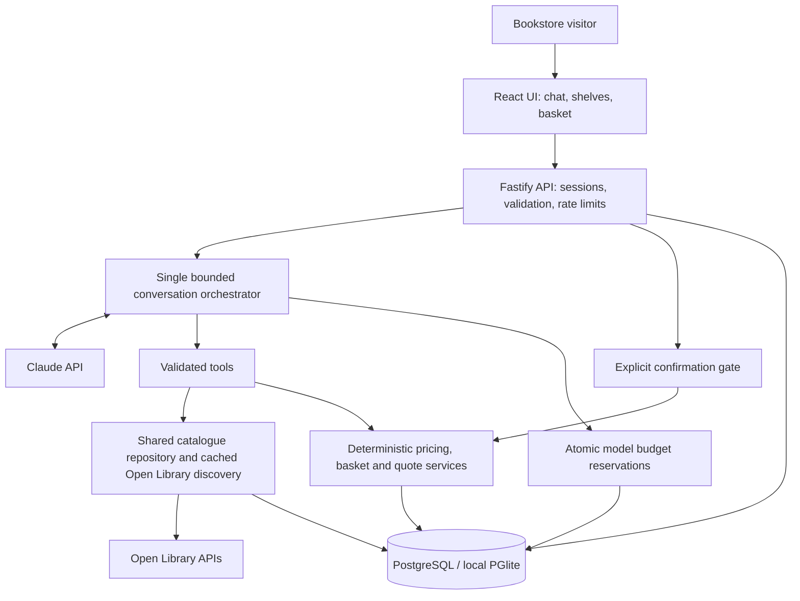

# Bookshop Assistant — Requirements

Version 1.2 · 30 September 2026 · Prototype

## Objective and success criteria

Provide an English-speaking conversational sales assistant for a fictional USD bookstore. Help a visitor discover suitable books and complete a simulated purchase with informed, explicit confirmation. The agent should behave like a helpful bookseller: curious, concise, respectful of budget and unpressured.

Success requires a runnable Git repository, a public browser demo, reproducible setup, source-backed recommendations, deterministic commerce, and documented evaluation. Local completion and public deployment are separate release gates. See `release-status.md` for verified release evidence.

## Audience and user stories

| ID    | Visitor                      | Story and acceptance criterion                                                                               |
| ----- | ---------------------------- | ------------------------------------------------------------------------------------------------------------ |
| US-01 | Exact-title shopper          | Find a title, author or ISBN; show the edition ID and do not silently substitute an edition.                 |
| US-02 | Undecided reader             | Describe a mood or favourite and get one helpful question followed by two or three relevant options.         |
| US-03 | Gift buyer                   | Get questions about the recipient, interests, approximate age and budget without requiring personal details. |
| US-04 | Parent or young reader       | Explore books by interests/reading level; unverified suitability must be acknowledged.                       |
| US-05 | Student/specialist           | Clarify subject and exact edition; unsupported syllabus equivalence must not be claimed.                     |
| US-06 | Budget shopper               | Keep recommendations within the stated limit; explain when no stocked option fits.                           |
| US-07 | Comparison shopper           | Compare available facts and explain recommendation judgement without invented plots or spoilers.             |
| US-08 | Returning-in-session shopper | Preserve preferences, rejected choices and basket across turns and page reloads.                             |
| US-09 | Ready-to-buy shopper         | See a calculated quote, explicitly confirm and receive a clearly labelled demo receipt.                      |
| US-10 | Shopper changing their mind  | Remove/change quantities, invalidate old quotes and continue without restarting.                             |
| US-11 | Unavailable-book shopper     | See honest availability and suitable alternatives; incomplete/work-only results stay discovery-only.         |
| US-12 | Visitor during an outage     | Preserve basket, display an honest failure and keep manual browsing/checkout available.                      |

## Functional requirements

| ID    | Requirement                                                                                        | Implementation/verification                                                                         |
| ----- | -------------------------------------------------------------------------------------------------- | --------------------------------------------------------------------------------------------------- |
| FR-01 | Greet, discover needs and adapt the conversation; ask one question at a time when needed.          | Agent prompt; customer scenario evaluation. Full natural-language quality requires live evaluation. |
| FR-02 | Search title, author, ISBN and subjects; filter category and price.                                | Curated browsing plus paginated live title/author/ISBN/topic discovery.                             |
| FR-03 | Preserve provenance, work/edition distinction and unknown fields.                                  | Edition IDs, source URL, retrieval time, explicit unspecified format.                               |
| FR-04 | Recommend/compare two or three source-backed books and preserve preferences/rejections.            | Search/details/preferences tools; persistent session state.                                         |
| FR-05 | Keep prices, availability and arithmetic outside the model.                                        | Store service, integer cents and frozen seed and admitted-edition prices.                           |
| FR-06 | Support conversational and UI basket changes.                                                      | Absolute-quantity tool/API; zero removes; maximum five copies/edition and twenty distinct editions. |
| FR-07 | Quote before ordering. Quotes expire after ten minutes and are invalidated by basket changes.      | Transactional quote and confirmation services.                                                      |
| FR-08 | Require explicit confirmation independent of model instructions.                                   | Confirm button with `confirmed:true`, or exact chat phrase `confirm order`.                         |
| FR-09 | Prevent duplicate orders.                                                                          | Unique quote and session/idempotency constraints; retries return the existing order.                |
| FR-10 | Show a receipt with reference, items and total; no real payment.                                   | Structured order response and receipt screen.                                                       |
| FR-11 | Present unstocked books accurately; no invented discount, tax or delivery charge.                  | Store policy and tool boundaries.                                                                   |
| FR-12 | Clearly distinguish offline guided demo from actual AI.                                            | Mode banner/config; invalid real-model access reports failure instead of switching silently.        |
| FR-13 | Recover from source failure using saved catalogue/cache; preserve commerce through model failures. | Timeouts, backoff, cached results and independent basket UI.                                        |
| FR-14 | Provide documented HTTP contracts and a UI handoff.                                                | OpenAPI 3.1, shared types and Claude Code brief.                                                    |

## Non-functional requirements

| ID     | Requirement         | Acceptance                                                                                                                                                     |
| ------ | ------------------- | -------------------------------------------------------------------------------------------------------------------------------------------------------------- |
| NFR-01 | Session privacy     | Opaque HttpOnly/SameSite cookies, hashed tokens at rest; other sessions cannot read or confirm quotes/orders. Secure cookies in production.                    |
| NFR-02 | Input/output safety | Validated payloads and tools, 2,000-character messages, 16 KB request limit, escaped React text, CSP, no raw HTML or model-supplied URLs used for execution.   |
| NFR-03 | Cost control        | Maximum configured $20 cumulative application allowance, persistent atomic reservations, bounded history/output/tool loops and separate provider spending cap. |
| NFR-04 | Rate control        | 90 requests/minute/IP globally; 12 chat requests and 10 session creations/minute/IP. Same-session writes cannot overlap in the single-instance deployment.     |
| NFR-05 | Data lifetime       | Expire anonymous sessions, related quotes and orders after seven days; hourly/startup purge. Reset deletes immediately. No raw chat in server logs.            |
| NFR-06 | Usability           | Keyboard-labelled controls and native accessible dialogs; no horizontal page overflow at tested desktop/mobile sizes; visible errors and loading state.        |
| NFR-07 | Performance         | Target 95% of warm AI turns under 15 seconds with three concurrent visitors. Measured live results and workload are recorded in evaluation.md.                 |
| NFR-08 | Reproducibility     | Committed lockfile, seed and schema; `npm ci`, build and start work without external credentials in offline mode.                                              |
| NFR-09 | Failure containment | Missing database blocks production startup; model/source errors do not fabricate an answer or erase the basket.                                                |
| NFR-10 | Observability       | Structured request/latency logs and budget ledger; retain error codes rather than credentials or raw conversations.                                            |

## Architecture diagram

The model has no order-creation tool. See `architecture.md` for interfaces, transaction boundaries and failure handling.

## Scope, assumptions and exclusions

- English conversation/UI, USD display, no customer sign-in. General bookstore audience; not a specialist medical/legal adviser.
- 97 imported editions form the curated shelves; validated discovered editions extend the fictional sellable inventory. Prices/stock are synthetic. Work-level subjects can be imperfect and are not age/content guarantees.
- No actual payment, shipment, tax, refunds, real-time merchant stock, email, SMS, voice, multilingual support or administration screen.
- No recommendation-training pipeline, vector database or multiple agents. Search, validated evidence selection and server-rendered facts are used.
- One server instance; free hosting can sleep and has quotas. External source and model availability are not guaranteed.
- The current UI was implemented directly because Claude Code was absent. A contract and brief allow later Claude Code refinement without redesigning the backend.
- Offline guided behaviour demonstrates commerce and constrained scenarios only; it does not satisfy the live conversational-agent acceptance gate.

## Release acceptance

1. Build and deterministic commerce/security checks pass.
2. Desktop/mobile browser journeys complete a purchase and detect stale quotes.
3. At least 18/20 live customer scenarios pass, plus review for unsupported facts and age suitability; no fabricated price, availability or successful-order claim.
4. Public URL serves the UI; health verifies database; a real AI conversation and confirmed demo purchase succeed on that URL.
5. README, source/price decision, architecture, requirements and evidence are committed to the repository.

Live evaluation and public deployment evidence are recorded in `evaluation.md` and `release-status.md`. Automated scenario passes are supplemented by transcript review; they are not a guarantee of correctness for every future model response.

## Accuracy and live discovery acceptance (v1.2)

- Every recommendation, comparison and follow-up book answer uses validated IDs and evidence, with exact catalogue titles. Unknown narrative, suitability and length facts remain unknown. Invalid output falls back to verified cards.
- The two original factual defects must pass five live repetitions each, alongside the 20-scenario suite. Warm response p95 target remains 15 seconds. Cold source lookup latency is reported separately.
- Explicit search submissions query Open Library even when saved matches exist. Search pagination uses a Load more control; shelves stay curated. ISBN-10/13 equivalence requires valid checksums; different editions are never substituted.
- Search cache: 24 hours. Detail cache: seven days. Identical in-flight source calls coalesce and upstream requests start at most once per second. Source failure displays saved results and a notice.
- Edition ID, title and author validation admits an edition to simulated stock with five copies per visitor. Work-only and incomplete records cannot be ordered. Format-based demo prices freeze at admission.
- Detail panels distinguish attributed work descriptions from edition pages, language and format; absent fields remain visibly unknown.
- New titles, ISBN fidelity, missing metadata, source outages and a newly discovered edition purchase surviving deployment must pass before live discovery is enabled.
- Each phase may use at most $2 of the current $20 cumulative application allowance; no automatic cap increase or reset. Free Render/Neon, English, USD and simulated purchases remain the scope.
